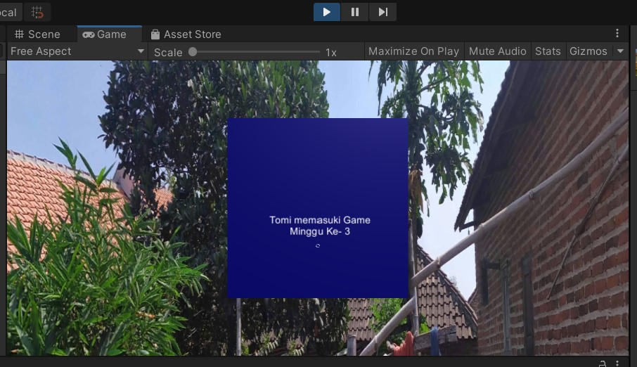
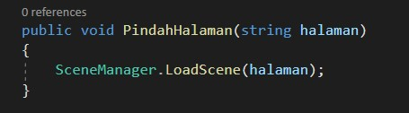

# Laporan Minggu ke 6

Nama    : Tomi Dwi Setyawan  
Kelas   : TI-4C  
Pemrograman Game
 
 

## 1 Menambahkan panorama

## 2 Menambahkan menu 3 (untuk setiap klik prak 3,4,5)
1. Tampilan menu awal(scene mainmenu)

    
    
    Ketika button game diklik maka akan ke tampilan menu pilihan game(scene mainmenu1)
     

2. Tampilan menu pilihan game(scene mainmenu1) dengan background panorama
    

3. Jika minggu 3 diklik maka hasilnya berikut :
    

4. Jika minggu 4 diklik maka hasilnya berikut :
    

5. Jika minggu 5 diklik maka hasilnya berikut :
    

6. Source code seperti pada praktikum, hanya saja mengubah fungsi inspector pada button ke scane yang dituju
    

    

## 3 Menambhkan Text ketika pindah scene game
 

